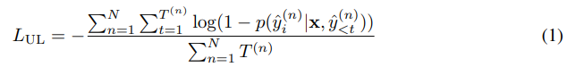
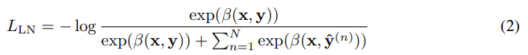
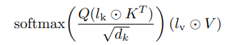
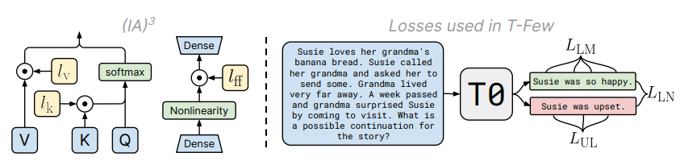
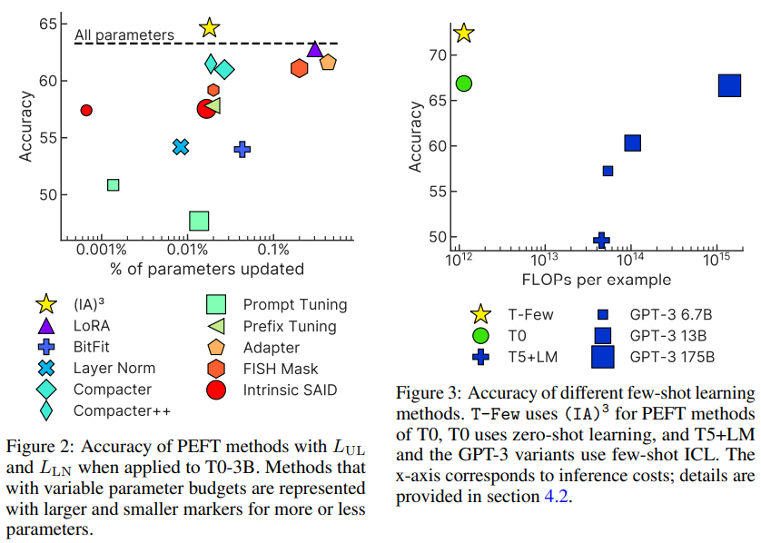
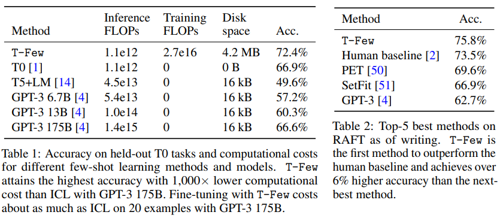

# Few-Shot Parameter-Efficient Fine-Tuning is Better and Cheaper than In-Context Learning

#### [Link](https://arxiv.org/abs/2205.05638)

#### Information

- Author/Institution : [Haokun Liu](https://arxiv.org/search/cs?searchtype=author&query=Liu,+H), [Derek Tam](https://arxiv.org/search/cs?searchtype=author&query=Tam,+D), [Mohammed Muqeeth](https://arxiv.org/search/cs?searchtype=author&query=Muqeeth,+M), [Jay Mohta](https://arxiv.org/search/cs?searchtype=author&query=Mohta,+J), [Tenghao Huang](https://arxiv.org/search/cs?searchtype=author&query=Huang,+T), [Mohit Bansal](https://arxiv.org/search/cs?searchtype=author&query=Bansal,+M), [Colin Raffel](https://arxiv.org/search/cs?searchtype=author&query=Raffel,+C)
- Conference/Journal : 36th Conference on Neural Information Processing Systems (NeurIPS 2022)
- Cited by 142 _ (2023.09.20)_
- Submitted on 11 May 2022 ([v1](https://arxiv.org/abs/2205.05638v1)), last revised 26 Aug 2022 (this version, v2)

### Abstract

**Few-shot in-context learning (ICL)**

- prompted example을 넣어 task를 수행하는 것으로, 적은 양의 input sample(input-target pair)을 인간이 이해할 수 있는 instruction-example로 변환하여 사전 학습된 언어 모델에 넣어 gradient 기반 훈련 없이 unseen task를 수행
- 모든 prompted input-target pair를 처리할 때, 예측이 수행될 때마다 모든 training sample을 처리하기 때문에 상당한 computation cost 발생
- fine-tuning보다 성능적으로 열등

**Parameter-efficient fine-tuning (PEFT)**

- 사전 학습 모델이 적은 양의 추가된/선택된 parameter만 업데이트하면서 fine-tuning 함으로써 새로운 task를 잘 수행하도록 하는 method

**본 논문에서의 PEFT**

- ICL보다 PEFT가 더 좋은 성능/더 낮은 비용
- 학습된 벡터로 intermediate activation을 scaling(multiply)하면서 상대적으로 적은 paramter 양 + 더 좋은 성능 수반하는 새로운 PEFT method `IA` 소개
- prompted dataset의 multi-task fine-tuning을 수행하는 T5의 변형인 `T0 모델` 사용
    
    ⇒ 이를 기반으로  task-specific tuning이나 modification 없이 new unseen task에 적용 가능한 `T-few`라고 불리는  새롭고 단순한 레시피(model, PEFT method 및 fixed hyper-parameter set)을 제안
    

### Background

**Few-shot in-context learning (ICL)**

- 특징
    - 모델에 “shot”이라고 불리는 input-target example을 넣어 task를 수행하도록 유도
    - Ex) 글자를 다시 풀어서 단어를 완성하는 task
        - asinoc = casino, yfrogg = froggy, plesim = simple, iggestb = biggest, astedro = “roasted”
        - autoregressive language model에 context를 넣어 샘플링
    - classification task의 경우 문자열과 관련된 각 label에 대해 모델이 가장 높은 확률을 할당한 label 문자열을 선택하여 label이 할당 (binary, multi classification 모두에 해당)
- 장점
    - fine-tuning 없이 즉시 다양한 task 수행 가능
        - 다양한 task를 혼합한 mixed task batch를 사용해 서로 다른 example이 input에서 서로 다른 context를 사용해 각각의 task에 사용 가능
    - 보통 제한된 수의 label example에만 사용하므로 적은 데이터로도 효율적 작동
- 단점
    - 모델이 예측을 수행할 때마다 모든 in-context label example을 처리 → `계산 비용 ↑`
    - `메모리 비용`도 k(k-shot 일 때)에 비례하여 선형 증가 + inference에서도 model parameter 저장하는 데에 사용
    - 특정 task에 대한 in-context example을 저장하는 데에 필여한 `디스크 스토리지` 필요
    - in-context example의 에제 순서가 모델 예측에 큰 영향을 미침

**Parameter-efficient fine-tuning**

- methods
    - 초기 method로 fixed pretrained model의 layer 사이에 Adapter를 넣어 학습하는 방법 제안
    - 훈련할 parameter의 sparse subset을 선택하는 method
    - Low-rank update를 생성하는 method
    - lower-dimensional supspace에서 optimization을 수행하는 method
    - hypercomplex multiplication을 사용하여 low-rank adapter를 추가하는 method
    - 모델의 input 또는 activation에 학습된 연속 embedding을 연결하여 task를 수행하도록 하는 prompt tuning / prefix tuning
    - SOTA : 모델의 parameter 중 일부분 (0.01%)만 업데이트하면서 성능을 맞출 수 있음
- 장점
    - training 및 모델 저장에 대한 메모리 비용 및 저장공간 비용 ↓
    - 특정 PEFT method는 mixed task batch를 간단하게 허용함
        - Ex) prompt tuning : batch의 각 example에 다른 prompt embedding을 연결하여 여러 task 수행가능하도록 함
- 단점
    - 모델을 다시 parameterize하는 PEFT method는 mixed task batch에 대해 비용이나 번거로움 발생
    - 모델에 layer를 추가할 경우 작지만 무시할 수 없는 양의 계산 및 메모리 비용 발생
    - Fine-tuning 자체에 대한 비용 발생

### Designing the T-Few Recipe

레시피란 특정 모델 및 하이퍼파라미터 설정을 의미

**Model and Datasets**

<aside>
💡 T5 model : Text-to-Text Transfer Transformer 
- 대량의 unlabeled text data에 대해 가리지 않고 언어 모델링을 하기 위해 사전 학습된 encoder-decoder Transformer 모델

</aside>

Model

- T5를 기반으로 하는 T0를 사용하며, T0는 여러 task를 수행할 수 있도록 training data 섞기를 통해 T5를 fine-tuning하여 만들어짐
- T0 버전으로 T0-3B와 T0가 있는데 각각 파라미터 30억개, 110억개 버전 ⇒ 논문에서는 T0-3B

Dataset

- 일반화 성능 입증하기 위해 RAFT benchmark 사용
- validation dataset이 없는 “real world” few-shot task의 모음

Comparison

- 각 데이터셋에 대해 용이하게 비교하기 위해 동일한 수의 few-shot learning example 사용
- robust한 비교를 위해 five few-shot dataset에 대해 서로 다른 seed로 subset을 샘플링하며 중간값과 사분위 범위를 기록함

Evaluation

- 평가를 할 땐 모든 가능한 label string에 대한 모델의 log-probability에 순위를 매기고 가장 높은 순위의 선택이 올바른 답으로 간주되는  “rank classification”을 사용한다.

**Unlikelihood Training and Length Normalization**

 언어 모델의 few-shot fine-tuning 성능 개선을 위해 **두 개의 추가 loss term**을 탐색한다. 언어 모델은 일반적으로 input sequence $\bold x$에 대해 올바른 target sequence인 $**y** = (y_1, y_2, …, y_T)$의 확률을 높이도록 하는 cross-entropy loss $L_{LM} = - \frac{1}{T} \sum_t \text{log } p(y_t | **x**, y_{<t})$로 훈련된다. 

**unlikelihood loss**

- 평가에 사용하는 rank classification의 특성상 모델이 올바른 선택을 할 확률 뿐만 아니라 올바르지 않은 선택을 할 확률에 대해서도 달라지기 때문에 unlikelihood loss를 추가
- 모델이 incorrect target sequence로부터 토큰을 예측하는 것을 억제하는 데에 사용된다.

**Length Normalization Loss**

- 각 선택지를 확률에 따라 순위를 매기면 모델은 답이 될 가능성이 높은 답을 “선호”하는 경향이 있음
- 이를 해결하기 위해 rank classification을 수행할 때 length normalization을 사용해, 모델의 가능한 답변 선택에 대한 점수를 각각 해당 선택의 token 수로 나눈다.
- 주어진 output sequence의 length-normalizaed log probability를 게산하고, softmax corss-entropy loss를 최소화하여 올바른 답변을 선택하는 length-normalizad log probability를 최대화

**Parameter-efficient fine-tuning with (IA; Infused Adapter by Inhibiting and Amplifying Inner Activations)**

모델 활성화에 대한 learned vector와의 element-wise product(rescaling)을 탐구

- 특히 $l \in \mathbb R^d$가 learned task-specidic vector이고 $x \in \mathbb R^{T \times d}$가 길이 $T$의 activation sequence인 $l \odot x$ 형태의 adaptation을 고려
- 초기 실험에서 연구진은 Tansformer 모델의 각 activation에 대한 learned rescaling vector를 도입할 필요가 없다는 것을 발견
    - 대신 self-attention 및 encoder-decoder attention mechanism에서 Key 및 Value에 대한 rescaling vector 및 position-wise feed-forward network의 intermediate activation에 대한 rescaling vector를 도입하는 것만으로 충분함을 발견
        
        
        
- 각 transformer layer block에 별도의 $l_k, l_v, l_{ff}$ vector set을 도입
    - encoder, decoder에 각각 $L(d_k + d_v + d_{ff}), L(2d_k + 2d_v + d_{ff})$개의 파라미터 추가
    - 초기화 단계에서 세 벡터 모두 1로 초기화되어 모델이 계산하는 전체 함수는 변하지 않음
- $(IA)^3$가 mixed task batch를 가능하게 만들어 batch의 각 activation sequence를 해당하는 learned task vector로 별도 처리하고 저렴하게 곱할 수 있다

### T-Few recipe & $(IA)^3$ diagram

### Experiment Result

### Conclusion

- T-Few : 계산 비용 줄이면서 몇가지 task에서 ICL보다 더 높은 정확도를 달성하는 parameter efficient solution
    - learned vector로 내부 activation 값을 조절하는 $(IA)^3$라는 새로운 PEFT method 사용
    - 모델 전체 fine-tuning 하는 것보다 훨씬 적은 수의 추가 파라미터로 더 좋은 성능 제공
    - 두 가지 추가 loss 도입
        - unlikelihood loss
        - length normalization loss
    - 하나의 dataset에 대해 single NVIDIA A100 GPU로 30분만에 fine-tuning 가능
