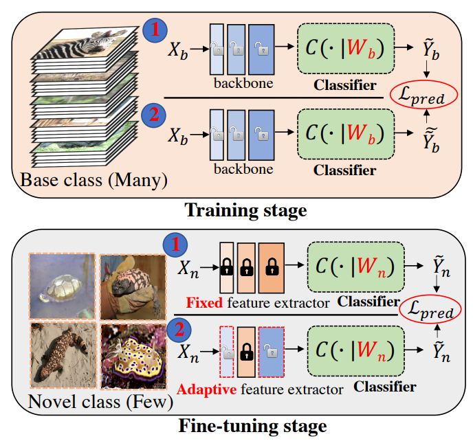
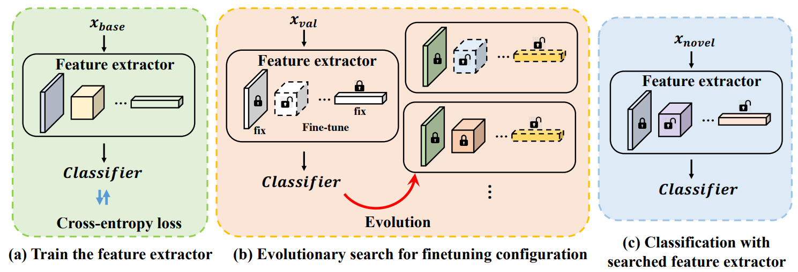
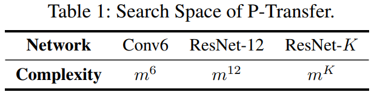
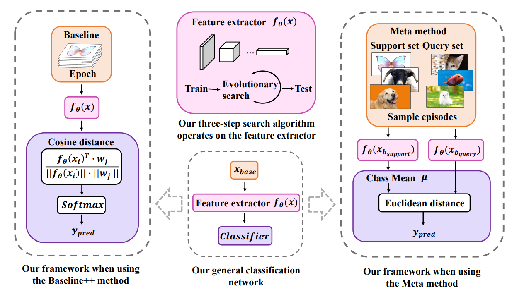
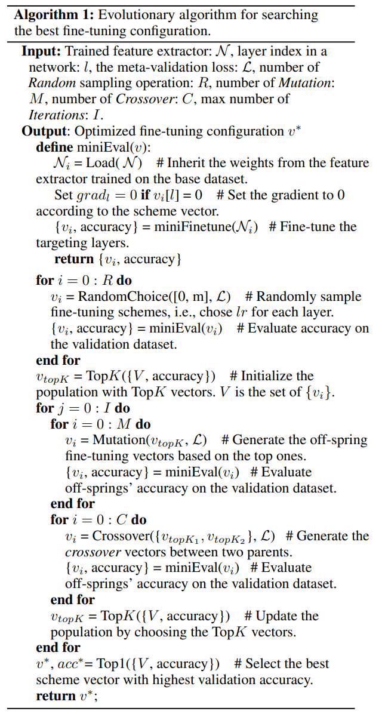

# Partial is Better Than All: Revisiting Fine-tuning Strategy for Few-shot Learning

#### Link

https://arxiv.org/abs/2102.03983

#### Information

- Author/Institution : [Zhiqiang Shen](https://arxiv.org/search/cs?searchtype=author&query=Shen%2C+Z), [Zechun Liu](https://arxiv.org/search/cs?searchtype=author&query=Liu%2C+Z), [Jie Qin](https://arxiv.org/search/cs?searchtype=author&query=Qin%2C+J), [Marios Savvides](https://arxiv.org/search/cs?searchtype=author&query=Savvides%2C+M), [Kwang-Ting Cheng](https://arxiv.org/search/cs?searchtype=author&query=Cheng%2C+K)
- Conference/Journal : AAAI 2021. A search based fine-tuning strategy for few-shot learning
- Cited by 71 (2023.09.11)
- Submitted on 8 Feb 2021

## Abstract
기본 데이터셋에 대해 훈련된 모델을 새로운 데이터셋에 대해 fine-tuning 할 때 전체 지식을 단순하게 transfer하는 것은 지양해야 한다. 기존 클래스와 새로운 집합 간 중복이 없기 때문에 기존 모델의 일부 지식이 새로운 클래스에 대해 편향되거나 유해할 수 있기 때문이다. 따라서 본 논문에서는 기존 모델의 특정 레이어를 동결하거나 fine-tuning 함으로써 partial knowledge를 전이하는 방법을 제안한다. fine-tuning 할 레이어를 선택하면 학습률을 서로 다르게 적용하여 transferability를 조정한다. transfer 할 대상 레이어를 찾고 각각의 학습률을 결정하기 위해 본 논문은 evolutionary search based method를 소개한다. CUB 및 mini-imageNet에 대한 광범위한 실험을 수행했고, meta learning과 non-meta based framework에서 모두 SOTA를 달성했다. 더 나아가 전통적인 pre-training + fine-tuning paradigm으로 확장하여 일관적인 개선을 얻는다. 

- 모든 레이어가 동결되는 특수한 경우에 대해 Few-shot classification을 위한 Partial Transfer (P-Transfer) 제시.
- base class에서 new class로 fine-tuning 하기 위한 layer-wise search space 소개.
- Conv6, ResNet-12 backbone에서 V100 GPU 하나에 탐색 알고리즘이 각각 약 6시간, 1일 소요
- Complete transfer와 hand-crafted transfer보다 훨씬 더 좋은 성능

## Comparison with Related Work
Few-shot Learning은 주로 meta learning method와 non-meta learning method로 분류되며, 본 논문에서는 few-shot learning을 위한 search based method도 고려한다. 

### Meta-based Few-shot Learning

 model이나 optimizer를 학습해 새로운 task에 빠르게 적응할 수 있도록 가중치를 빠르게 업데이트하는 방식. 예를 들면 신속한 generalization을 위한 meta-level knowledge를 학습하는 MetaNetwork가 있으며 LSTM 기반 meta-learner model을 사용해 최적화 알고리즘 학습하는 경우도 존재한다. 또한, MAML은 MetaNetwork를 단순화하여 초기 learner parameter만 학습해 신속하게 적응하고 새로운 task에 대해 높은 generalization을 갖도록 했다.  ProtoNet은 Metric learning 기법으로 one-shot에서 few-shot learning으로 일반화되었다. 

### Non-Meta Few-shot Learning

 Cosine similarity를 활용해 weight generator로 새로운 class clasffier를 예측하는 방법, 임베딩 레이어 activation을 기반으로 weight를 직접 설정하는 방법, image 영역에서 distance 게산을 위해 dense representation을 사용하는 방법, intra-class variation을 줄이고 similarity를 제한해 경쟁력 있는 성능을 달성하는 방법 등이 있다. <U>본 논문에서는 더 발전된  optimizer나 classification metric을 학습하는 대신 evolutionary search를 통해 meta knowledge transfer scheme을 찾아 해결한다. </U>

### Neural architecture search for few-shot learning

 Evolutionary based NAS는 주어진 architecture search space 내에서 진화하며 final model에서 top gene을 선택하기 위한 gene의 population (예를 들면 아키텍처의 operation choice)을 업데이트한다. 최근 연구로는 NAS를 weight 기반 meta learning과 통합해 few-shot learning에 적용하는 것이 제안되었다. NAS와 달리, <U>본 논문의 P-Transfer는 architecture가 아닌 fine-tuning method를 찾기 위해 evolutionary algorithm을 사용한다.</U> MAML-SGD와 MAML++는 네트워크의 각 레이어에 대한 다양한 학습률을 학습할 수 있지만 주로 MAML과 유사한 방법을 위해 설계되어 meta-learning 기반 시나리오에나 적합하다. <U>반면 본 논문의 방법은 학습률을 완전히 0으로 만들고 레이어의 weight를 고정시킬 수 있는 더 일반적인 설계를 제공하며 few-shot learning task에 적합하다. </U>

 *본 논문의 방법은 Meta/non-Meta 방법 모두에 적용 가능

## Key Point
전체 프레임워크는 3단계로 구성

1. base class cample에 대해 base model 훈련
2. accuracy metric 기반으로 최적의 tansfer strategy 탐색을 위해 evolutionary search 적용
3. partially fine-tuning을 통해 탐색된 strategy로 base model을 new class로 transfer

### Step 1: Base class Pre-training

 standard cross-entropy objective function을 minimize하여 모델을 처음부터 훈련시키는 흔한 방법으로 base model을 훈련한다. meta-learning pipeline의 경우 meta-pretraining 또한 base support set에 대해 meta-learning classifier가 조건을 만족하는 전통적인 전략을 사용한다. 구체적으로 말하면, meta-pretraining stage에서 base class에서의 support set과 query set은 먼저 $N$개의 class에서 무작위 샘플링되고, 그런 다음 $N$-way prediction loss를 minimize하기 위해 파라미터를 훈련시킨다. 

### Step 2: Evolutionary search

 representation transfer stage에서 어떤 레이어가 고정되고 어떤 레이어가 fine-tuning 될지 결정하기 위해 다양한 fine-tuning strategy로 evolutionary search를 수행한다. pretraining을 통한 단순한 baseline + fine-tuning과 meta-based method의 두 가지 시나리오에서 evolutionary search task는 약간 다르다. 이 부분은 Algorithm에서 자세하게 설명한다. 

### Step 3: Partially transfer via searched strategy

 최종 단계에서는 찾은 transfer strategy를 novel class에 적용한다. simple-baseline 방식은 backbone을 고정하고 마지막 linear layer만 fine-tuning하는 반면, meta-learning method는 meta-testing을 위해 base network를 feature extractor로 사용한다. 두 유형의 메소드에 대한 탐색 전략을 기반으로 새로운 support set에서 base network를 부분적으로 fine-tuning 한다.

## Algorithm
### Search Space

이 space는 layer-level selection (fine-tuning or freezing)과 fine-tuning에 대한 learning rate assignment를 포함한다. search space는 $mk$로 정의될 수 있으며, 여기서 $m$은 learning rate 값의 선택 수이고 $k$는 network layer의 수이다. 

예를 들어, learning rate $\in \{0, 0.01, 0.1, 1.0\}$($0$은 freezing)을 learning rate 공간으로 선택하면 $m = 4$이다. Conv6의 경우 search space에는 $4^6$개의 transfer strategy가 포함된다. 

본 논문의 방법은 fine-tuning 중에 각 layer에 대한 최적의 selection을 learning rate selection space에서 자동으로 찾을 수 있다. 더 깊은 네트워크를 선택할 경우 공간이 급격하게 커진다.

### Search Algorithm

 evolutionary algorithm을 따라 reproduction, crossover, mutation stage를 수행한다. 

1. 본 논문의 시나리오에서는 먼저 transfer strategy의 population이 벡터 $\mathcal V$에 포함되고 무작위로 초기화된다. 각 개별 $v$는 fine-tuning을 위한 strategy를 포함한다. 
2. 초기화 후에는 각 개별 strategy $v$를 평가하여 validation set에서의 accuracy를 얻고, 상위 $K$개를 선택하여 posterity[후손] strategy를 생성한다. 
3. 다음 세대 strategy는 mutation과 crossover를 통해 생성된다. 

 위 과정을 반복하여 validation performance가 가장 좋은 fine-tuning strategy를 찾는다. 각 layer에서 learning rate는 모든 가능한 선택지를 포함하는, 사전 정의된 learning rate selection space에서 선택된다. 

### Incorporating into Few-Shot Classification Frameworks

아래 그림과 같이 기존 few-shot classification framework에 search algorithm을 통합하는 방법을 소개한다. 본 논문에서는 non-meta baseline++(Chen et al. 2019)와 meta ProtoNet (Snell, Swersky, and Zemel 2017)을 예시로 선택한다. non-meta baseline++은 training 및 fine-tuning 단계에서 feature와 weight vector 사이 cosine distance를 적용함으로써 feature 간 intra-class variation을 명시적으로 줄이는 것을 목표로 한다. 

 search에서는  distance based classification의 디자인을 따르지만 fine-tuning 중 서로 다른 layer에 대한 다양한 learning rate를 탐색함으로써 backbone feature extractor $f_\theta (x)$를 조정한다. 직관적으로 본 논문의 탐색 방법으로부터 learned backbone과 distance based classifier는 backbone network를 고정하고 few-shot classification을 위해 weight vector만 fine-tuning하는 것보다 조화롭고 강력하다고 할 수 있다. 본 논문의 전체 모델이 end-to-end로 조정되기 때문이다.
 
 

## Formulation
### Preliminary and Definition

 few-shot classification task에서 base classes $\bold L_b$의 풍부한 라벨링 이미지 $\bold X_b$와 novel classes $\bold L_b$의 적은 양의 라벨링 이미지 $\bold X_n$이 주어지며 $\bold L_b \cap \bold L_n = \empty$이다. N-way K-shot task를 고려하면, 여기서 novel class에 대한 support set은 $K$개의 라벨링 이미지를 갖는 $N$개의 class와 각 class에 대해 라벨링되지 않은 Q개의 이미지를 갖는 동일한 $N$개를 포함한다. Few-shot classification algorithm은 $N$개의 class의 Query set 내의 $N \times Q$개의 이미지를 인식하기 위한 분류기를 학습하는 것이다. 

P-Transfer의 목표는 최적의 transfer learning scheme $V^*_\text{lr}$을 찾는 것이다. 네트워크가 해당 방법에 따라 fine-tuning 될 때 최대 accuracy를 달성하도록 하는 것이다: 

$$
V^*_\text{lr} = \text{arg max Acc}(W, V_\text{lr}) \ \ \ \ \ \ (1)
$$

여기서 $V_\text{lr} = [v_1, v_2, ..., v_L]$은 feature extractor를 fine-tuning하기 위한 layer-wise learning rate를 정의하고, $W$는 네트워크 파라미터이며 $L$은 전체 layer 개수를 나타낸다.

## Insight
수식적으로 optimize를 하는 논문은 아니지만 search algorithm을 통해 최적의 layer-wise learning rate를 찾는다는 점에서 참신한 방법이었던 것 같다. 이 논문의 결과를 통해 fine-tuning을 위한 weight만 중요한 것이 아니라 각 layer의 learning rate도 잘 조정해주는 게 중요하다는 관점을 얻어갈 수 있는 것 같다. 하지만 진화 알고리즘을 통해 end-to-end 방식으로 진행되는 만큼 적지 않은 시간이 소요된다는 점에서 실험적으로 시간이 부족한 우리에게는 부적절할 수도 있겠다는 생각이 들었다.