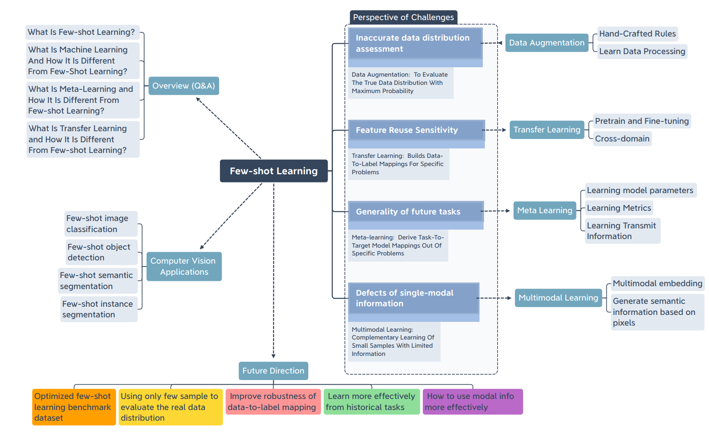
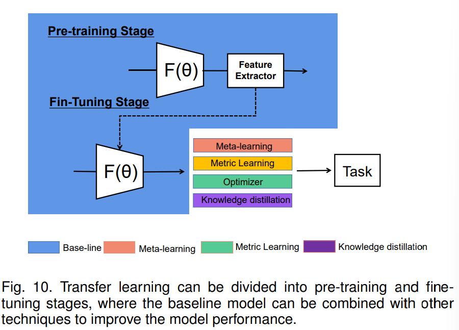
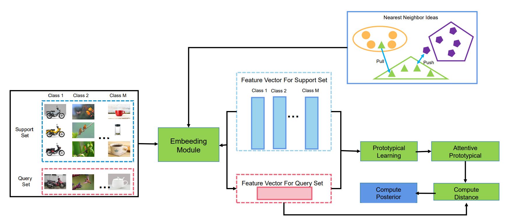
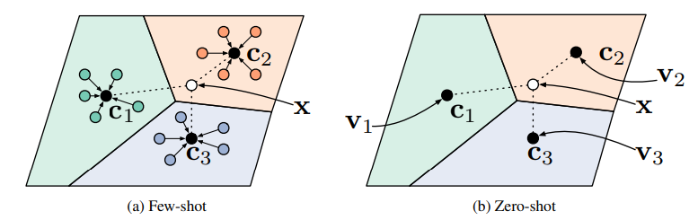
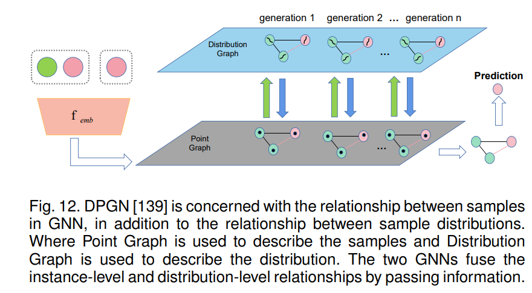

## Abstract

- Few-shot Learning (FSL)은 effective하고 potential을 보여주는 method임
- 이 survey : FSL을 해결하기 위한 최근 3년 간의 200개 이상의 논문을 담고 있음
    - few-shot larning, transfer learning, meta-learning 세 개의 개념을 비교함
    - FSL을 해결하기 위한 4가지 접근법 소개(data augmentation, transfer learning, meta learning, multimodal learning)
    - FSL의 응용과 앞으로의 trend를 소개

### The conceptual map of the survey

## Perspective of Challenges

### Data Augmentation

`(생략)`

### Transfer Learning

: Transfer Learning builds data-to-label mappings for specific problems

- core idea : feature reuse
    - 다른 모델로 학습한 feature를 Few-shot task를 풀기 위해 사용한다는 의미
    - limited support set을 이용하여 fine-tune
- source와 target domain 사이의 큰 차이가 있다면 성능이 떨어짐
    
    → cross-domain setting이 transfer learning의 challenge라고 할 수 있음
    

#### Pre-training and Fine-tuning

- 주로 비슷한 domain에서 학습한 large scale 모델로부터 추출한 정보를 사용
- 흔한 시도 : classfier 부분을 제외한 convolutional NN이나 auto-encoder를 backbone model로 디자인
    
    → input : 이미지, output : feature (embedded in high-dimensional space)
    
    - feature vector는 이미지의 충분한 valid semantic information을 가지고 있음
- Fine-tuning : pre-training 한 대부분의 parameter는 freeze, classification layer parameter만 update
- Related Works
    - [75], [76], [77] : fine-tuning SOTA meta-learning이나 semi-supervised learning framework으로 embedding될 수 있다.
    - [76] : activation function을 cosine similarity로 변경
    - [74] : convolutional gradient descent → adaptive gradient descent
    - [78] : specific layer들만 학습
    - etc

#### Cross-Domain Few-shot Learning

- 준비되어 있는 대량의 데이터와 실제 데이터가 비슷한 domain일 가능성이 현저히 낮음
- Meta-Dataset : Google이 발표한 FSL cross-domain dataset
    - ImageNet, CUB-200-2011 등의 10가지 데이터셋 포함
    - 하지만 few-shot task 데이터가 이와 비슷하지 않은 real world scenario도 여전히 존재
- 현재 : domain-irrelevant feature를 구분하기 위한 연구, domain **adaptive** 기술 연구
- Related Works
    - [83] : different domain들로 학습한 feature set을 training함으로써 multiple domain representations를 얻음, 다른 domain으로 migration하기 쉽도록 학습
        
        → domain이 orthogonal하다면 not effective
        
    - [84] : Ridge regression을 이용하여 feature을 reconstruct, normalize 진행, FSL의 potential space를 탐색
        
        → 새로 parameter 학습 X
        
    - etc

**#### Discussion and Summary**

- standard FSL setting에서, meta-learning이 transfer learning보다 높은 성능
    
    → but cross-domain FSL setting에서는 반대의 성능을 보임
    
- pre-training과 fine-tuning을 하는 것은 domain이 orthogonal한 경우에 한계가 있음

## Meta Learning

: Meta Learning derive task-to-target models mappings Independents

- 현재 가지고 있는 task로부터 meta-knowledge를 추출하여 future tasks에 적용
- task space 상에서 optimal initialization parameter를 탐색하는 것
    
    → specific problem을 해결하기 위한 방법이 아님!
    
- 주로 gradient descent 방법을 사용, reinforcement learning, metric method의 non-gradient descent 방법도 사용

#### Learning Model Parameters

- parameter initialization method (uniform, normal, 등등) 의 단점 : local optima에 빠지기 쉬움
- Meta-Learning의 목적 : hyperparameter generator를 학습
    - MAML [94] : 각 task의 optimization direction을 계산함으로써 global optimization direction을 결정
    - Reptile [95] : MAML에 비해 적은 수의 parameter를 update
- Meta Learning vs. Multi-task Learning
    - 현재 task에 얼마나 집중하고 있는지에 따라 구분
    - Multi-task Learning : 지금의 task를 해결하는 것이 목표
    - Meta Learning : 앞으로 만나게 될 task들을 해결하는 것이 목표
- standard FSL 문제에 대해 transfer learning보다 성능이 낫다고 알려져 있지만, 모델의 구조나 hyperparameter tuning에 더 민감함
    - 이 문제를 해결하기 위해 변형된 연구가 많이 진행됨
    - MAML++[96], First-order MAML[95], Meta-SGD[97], TAML[98], …
    - 자세한 사항은 논문 참고
- Learning optimizer의 또다른 중요한 목적 : learning model parameters
    - [104], [105] : **LSTM**을 기반으로 현재 time t와 이전 time t-1에서의 hidden state와의 difference를 학습에 사용
    - [106] : LSTM training을 supervise하는 BPTT 제안
    - etc
- Neural Architecture Search (NAS)에도 meta-learning 아이디어 적용하여 FSL 상황에 적용
    - one-shot NAS, MetaNAS 등의 related work 존재

#### Learning Metric Algorithm

- meta-learning과 다르게 classic meta learning은 training, testing stage로 모델을 분리하지 않음
- 다른 survey에서는 metric learning과 meta learning을 따로 설명하는 경우가 많지만, 이 survey에서는 meta metric learning 관점에서 설명
- Siamese neural network : sample끼리의 거리를 줄이거나 늘리는 방법
    - siamese neural network [119] : binary classification이라고 생각하면, positive 혹은 negative sample pair를 골라 input으로 집어 넣고, 두 이미지가 inference stage에서 얼마나 simliar한지를 평가 지표로 삼음
    - Triple loss [120] : anchor가 positive와는 가깝고 negative와는 멀게
    - [121] : data끼리 너무 쉽게 구분되면, 모델이 discriminative한 feature를 학습하는 데 이점이 없기 때문에 hard sample selection technique 제시
    - [122] : K-tuple에 대해 classical triplet network 진행
- Prototype network : 동일한 class 속 feature average는 data의 prototype을 표현한다고 생각
    - 단점 : noise에 민감하게 반응하여, 쉽게 distribution이 변할 수 있음
    
    
    
    - Prototype network [123]
    - [124] ~ [128] : prototype들 간의 거리를 멀게 하는 연구
    - [129] : **positive & negetive margin을** 제안하여 over-fitting 방지, generalization 증가
- Matching network : more general network framework
    - few-shot dataset, unlabeled data를 embedding space에 mapping
    - nearest neighbor algorithm 이용 : embedding representation 자체를 끌어 올리기 위한 학습
    - [130] : 실험, embedding propagation이 smoother embedding manifold를 만든다고 주장
    - [131] : visual embedding, semantic embedding 사용
    - etc
- Relational network [133] : similarity를 neural network로 계산
    - [122] : pretrained feature extractor 사용
    - [134] : multiple embedded module

#### Learning to Transmit Information

- GNN은 관계를 중심으로 한 task를 잘 해결할 수 있음
- Class-based transfer는 FSL 학습 중 들어오는 새로운 클래스에 대한 정보를 빠르게 파악할 수 있다고 함
    1. GNN이 서로 다른 노드 사이의 weight propagation을 나타낼 수 있음
        - 각 노드는 one-hot encoding이나 embedding vector로 이루어져 있음
        - edge를 통해 노드 간의 connection을 표현
    2. 이를 각각 support set과 query set에 대해 만들어서 차이를 관찰
    
    
    

#### Discussion and Summary

- meta learning은 target model에 task를 빠르게 맞추는 방법을 찾고 있음
- 한계 : 모든 condition에 대해 universe하지는 않음, 마찬가지로 domain gap 에 따라 성능이 좌우됨

### Multimodal Complementary Learning

: Multimodal Complementary Learning of small samples with limited Information

(생략)

## FSL Applications in CV

- Few-shot Image Classification
- Few-shot Object Detection
- Few-shot Semantic Segmentation
- Few-shot Instance Segmentation

## Future Direction and Opportunities of FSL

- Better evaluation of data distribution
    - 실제 데이터 분포에 대한 정보가 너무 부족함 (few-shot)
    - [215], [36]
- Improving the robustness of data-to-label mapping
- Learn meta-knowledge more effectively from historical tasks
- Full convergence of multimodal information