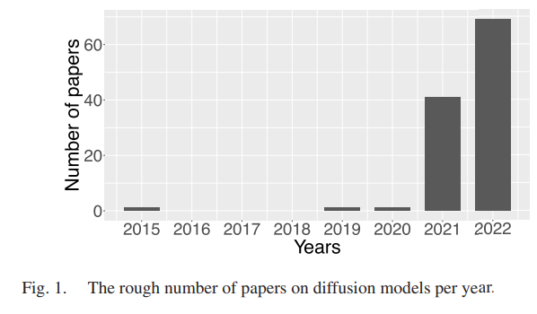
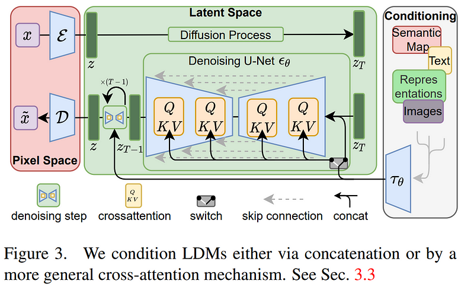
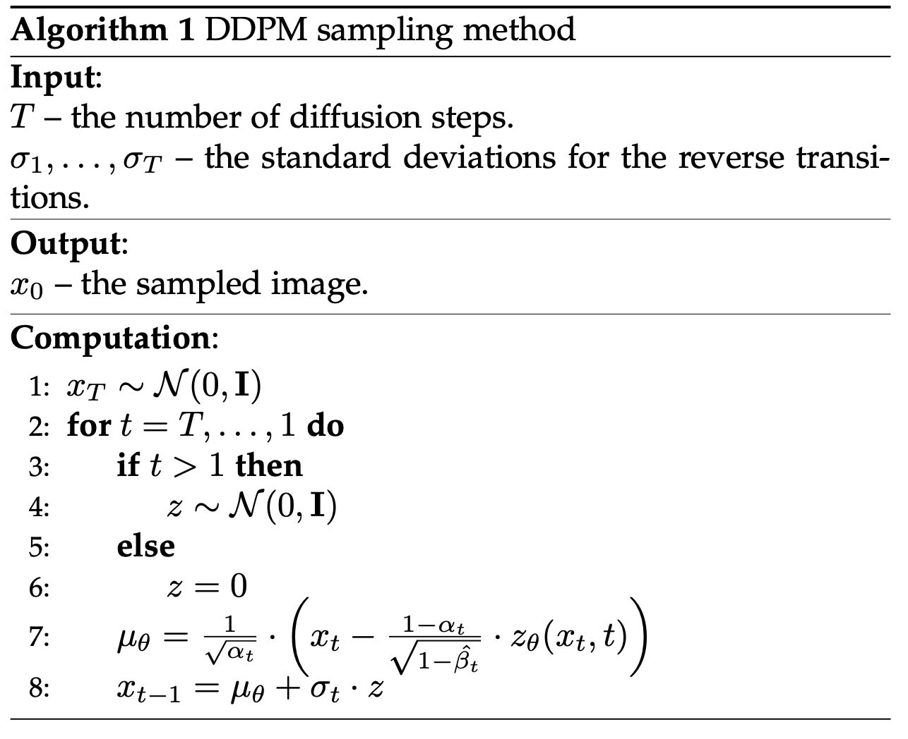

# Diffusion Models in Vision: A Survey

### Reference

[Diffusion Models in Vision: A Survey](https://arxiv.org/abs/2209.04747)

Accepted in IEEE Transactions on Pattern Analysis and Machine Intelligence, 2022

# Abstract

- Denoising diffusion model은 generative modeling 분야에서 주목할만한 결과를 내고 있음
- diffusion model은 2단계를 기반으로 함
    - forward diffusion : input에 Guassian noise를 step에 걸쳐 추가하여 gradually perturbed
    - reverse diffusion : original input으로 recovering, step by step
- **computational burden** : low speeds due to the high number of steps involved during sampling
- Three generic diffusion modeling framework
    1. denoising diffusion probabilistic models
    2. noise conditioned socre networks
    3. stochastic differential equations
- 다른 deep generative models과의 관계 설명(VAE, GAN, energy-based models, autoregressive models, normalizing flows)
- CV에서의 적용 소개
- 현재의 diffusion model 한계와 앞으로의 연구 방향 설명

# 1 Introduction

Diffusion models : detail과 diversity 측면에서 generative capability를 높게 평가 받고 있는 기술

최근 활발하게 연구 되고 있는 분야

** LDMs(Latent Diffusion Models) : 다른 domain에서의 단서를 conditioning으로 주는 diffusion

ex) Stable Diffusion : text-to-Image, generated images based on text prompts

prompt로 주어지는 정보들에 대해 굉장히 잘 이미지를 만들어냄 

→ 비현실적인 것도 가능함 (training 시에 본 적 없는 데이터임에도)

→ high generalization capacity of diffusion models

## 적용 task

### generative modeling tasks

- image generation
- image super-resolution
- image inpainting
- image editing
- image-to-image translation
- etc

### discriminative tasks

: diffusion model로부터 학습한 latent representation이 효과적인 task들

- image segmentation
- classification
- anomaly detection

## 2 steps process

1. forward step : input data가 점진적으로 perturbed, by adding Gaussian noise
2. reverse(backward) step : diffused data로부터 original input data로 점차 recovering

## 분류

### 1) denoising diffusion probabilistic models (DDPMs)

- non-equilibrium thermodynamics theory(비평형 열역학)로부터 영감 받음
- 확률 분포를 평가하기 위해 latent variable을 사용하는 latent variable models
- VAEs(Variational auto-encoders)의 한 종류라 볼 수 있음
    - forward diffusion stage = encoding process
    - reverse diffusion stage = decoding process

### 2) noise conditioned score networks (NCSNs)

- 저차원 manifold 문제에서 score 정의
- 다양한 종류의 Gaussian noise를 데이터 분포에 추가하고, 그 gradient를 통해 score matching이 가능하게 함
- 모든 level의 noise를 추가한 데이터 분포의 gradient를 활용하여 score network를 학습시킨 후 데이터를 sampling함

### 3) Stochastic differential equations (SDEs)

- strong theoretical result를 기반으로 efficient generation strategy를 제안
- DDPMs과 NCSNs를 **일반화**(포괄)하는 관점

# 2 Generic Framework

1. former phase (forward)
    - low-level noise를 각 input 이미지에 추가
    - step에 따른 noise scale은 다양함 (주로 점점 커지게 한다고 함)
    - input 이미지는 점차 pure Guassian noise로 변함
2. latter phase (reverse)
    - forward diffusion process의 reversing을 나타냄
    - iterative하게 진행되는 것은 동일하나, noise가 점차 제거되어 original image로 recreated
    - at inference time, random white noise로부터 image를 만들어 냄!
    - noise 제거 과정은 neural network로 진행 (주로 U-Net, dimension 보존)

아래의 3개 subsection은 diffusion model의 formulation 종류

→ 각각에 대해 adding noise, learning method to reverse, how new samples are generated at inference time 세 가지를 설명함

## 2.1 Denoising Diffusion Probabilistic Model (DDPMs)

### forward process

- DDPMs은 Gaussian noise를 이용해 training data를 천천히 손상시킴
- $p(x_0)$ : data density, 0은 아직 손상되지 않았다는 의미 (original), $x\sim p(x_0)$
- Markovian process : $p(x_t|x_{t-1})=\mathcal N(x_t;\sqrt{1-\beta_t}\cdot x_{t-1}, \beta_t \cdot I), \forall t \in \{1, ... , T\}$
    - $T$ : diffusion steps
    - $\beta_1,...,\beta_T \in [0,1)$ : hyperparameters, variance schedule
    - $I$ : identity matrix, input data와 동일한 dimension
    - $\mathcal N(x;\mu, \sigma)$ : mean, covariance that produces $x$
- An Important property of this recursive formulation is that it also allows the **direct sampling** of $x_t$, when $t$ is drawn from uniform distribution,
 $i.e. ~~\forall t \sim \mathcal U(\{1,...,T\}): ~~p(x_t|x_0)=\mathcal N(x_t;\sqrt{\hat\beta_t} \cdot x_0, (1-\hat \beta_t)\cdot I)$
          where $\hat \beta_t=\Pi^t_{i=1}\alpha_i$,  $\alpha_t = 1-\beta_t$
    
    → single step으로 any noisy version $x_t$를 만들 수 있음
    
- **Reparameterization Trick**
    
    [[딥러닝] Reparameterization Trick](https://velog.io/@nochesita/딥러닝-Reparameterization-Trick)
    
    - sampling 연산 ($p(x_t|x_0)$)을 미분할 수 없어 backprop하지 못하는 문제를 해결
    - in general
        1. sample $x$를 normal distribution으로 standardize  → $x\sim\mathcal N(\mu, \sigma^2 \cdot I)$
        2. standard normal distribution으로 변경 → $z=\frac{x-\mu}{\sigma}, z\sim \mathcal N(0, I)$
    - reparameterization trick : general 과정의 inverse
        
        → $x=\mu+z\cdot \sigma$
        
    - 우리 문제에 적용해보면 ($p(x_t|x_0)=\mathcal N(x_t;\sqrt{\hat\beta_t} \cdot x_0, (1-\hat \beta_t)\cdot I)$ )
        
        $x_t=\sqrt{\hat\beta_t}\cdot x_0+\sqrt{1-\hat \beta_t}\cdot z_t, ~~~~where ~~z_t\sim\mathcal N(0,I)$
        
- $\beta_t$의 성질
    - T가 커질수록 값이 작아진다면, 위의 식에서 distribution이 $\mathcal N(0,I)$에 가까워짐
    - $(\beta_t)^T_{t=1}<<1$ 이라면 reverse steps $p(x_{t-1}|x_t)$는 forward steps $p(x_t|x_{t-1})$과 같은 functional form을 가짐
    - 매우 작은 값을 갖는다면 $x_t$는 $x_{t-1}$와 매우 가까운 영역에서 발견될 것이므로, Gaussian distribution으로 영역을 표현해도 됨을 알 수 있음

### reverse process

- forward process 특징을 바탕으로, 새로운 sample $p(x_0)$을 만들기 위해  $x_T \sim \mathcal N(0, I)$에서 시작할 수 있음
- $p(x_{t-1}|x_t)=\mathcal N(x_{t-1};\mu(x_t, t), \Sigma(x_t, t))$
    - 정확한 $\mu, \Sigma$를 모르기 때문에, Neural Network을 학습 시켜 approximation
    - $p_\theta(x_{t-1}|x_t)=\mathcal N(x_{t-1};\mu_\theta(x_{t},t), \Sigma_\theta(x_t, t))$
        
        → input : noisy image $x_t$, embedding time step $t$
        
        → predict : $\mu_\theta(x_t, t)$, $\Sigma_\theta(x_t, t)$
        
- $p_\theta(x_0)$ : 모든 가능한 reverse trajectories에 대한 marginalize이므로 intractable (다루기 힘듦)
    - negative log-likelihood의 lower-bound를 minimize하는 문제로!
- $\mathcal L_{vlb} = -\log p_\theta(x_0|x_1)+KL(p(x_T|x_0)||\pi(x_T))+\sum_{t>1}KL(p(x_{t-1}|x_t,x_0)||p_\theta(x_{t-1}|x_t))$
    - $KL$ : 두 확률분포 사이의 KL-divergence
    - second term : $\theta$와 관련 없어 제거 가능(상수)
    - last term : model에서 구한 예측 분포와 실제 분포 사이의 차이를 최소화하도록 학습 진행
- Ho et al. [2] 은 covariance를 상수로 고정하고 mean을 새로 작성
    
    $\mu_\theta = \frac{1}{\sqrt{\alpha_t}}\cdot(x_t-\frac{1-\alpha_t}{\sqrt{1-\hat \beta_t}}\cdot z_\theta(x_t, t))$
    
    - objective $\mathcal L_{vlb}$ : random time step t of forward process에서 real noise $z_t$와 모델이 예측한 noise $z_\theta(x_t, t)$의 거리를 최소화
    - $\mathcal L_{simple} = \mathbb E_{t\sim[1,T]}\mathbb E_{x_0\sim p(x_0)}\mathbb E_{z_t\sim \mathcal N(0, I)}{||z_t-z_\theta(x_t, t)||}^2$
        - 모든 time step t에 대해, t 일 때 모델이 예측한 noise $x_t$ 의 정규화된 분포와 standard normal distribution 분포가 얼마나 다른지
        - $x_0$ : random image from training set
- algorithm

- generative process : neural network를 통해 noise를 예측하도록 학습하는 과정
- model의 역할 : $z_\theta(x_t,t )$ 생성 ($\mu_\theta$는 계산, $\sigma_t$는 constant)

## 2.2 Noise Conditioned Score Networks (NCSNs)

- data density $p(x)$의 score function = $\nabla_x \log p(x)$ (logarithmic data density)
- sample할 데이터를 random sample($x^0$)로부터 시작해 반복적으로 이동해 toward sample($x^N$)을 찾기  (Langevin dynamics algorithm에 사용)
    
    → log-density가 가장 빠르게 증가하는 방향을 가리키는 grad를 이용하여 update하는 것
    
    → probability distribution에서의 gradient ascent라고 생각!
    

### Langevin dynamics algorithm

- data sampling에 사용되는 iterative method

$$
x_i= x_{i-1}+\frac{\gamma}{2}\nabla_x \log p(x)+\sqrt{\gamma}\cdot \omega_i
$$

- $\nabla_x \log p(x)$ : score, 현재 데이터로부터 더 높은 확률분포를 가지는 쪽으로 이동하여 다음 데이터를 샘플링하게 함
- 분포 상에서 높은 값을 갖는 방향으로 이동하려는 힘(gradient)과 random하게 이동하여 local 에 빠지는 것을 방지하는 힘($\omega$) 존재
    - $i\in\{1,\dots,N\}$
    - $\gamma$ : score의 update magnitude를 control
    - $x_0$ : prior distribution에서 샘플링한 값
    - $\omega_i\sim \mathcal N(0, I)$
    - $N\rarr\infin$ recursive step 반복

### Score Matching

- generative model : $s_\theta\approx\nabla_x\log p(x)$인 score를 예측하는 것이 목적
    - $p(x)$를 추정하는 별도의 모델 없이 score network $s_\theta(x)$가 바로 추정
- score matching을 통해 학습 진행
- $\mathcal L_{sm}=\mathbb E_{x\sim p(x)}{||s_\theta(x)-\nabla_x \log p(x)||}^2_2$
- 동치 증명
    
     $E_{x\sim p(x)}{||s_\theta(x)-\nabla_x \log p(x)||}^2_2$
    
    $=\mathbb E_{x\sim p(x)} ||\{s_\theta(x)\}^2-2\cdot s_\theta(x)\cdot\nabla_x \log p(x) + \{\nabla_x \log p(x)\}^2||_2$
    
    - 마지막 항 : 상수 → 무시해도 됨
    
    $=\mathbb E_{x\sim p(x)} [\|s_\theta(x)\|_2^2-2\cdot s_\theta(x)\cdot\nabla_x \log p(x) ]$
    
    - 두 번째 항은 integration by parts에 의해 tr로 표현됨
    
    $\therefore \mathbb E_{x\sim p(x)}[2\cdot tr(\nabla_x s_\theta(x))+|s_\theta(x)|_2^2]$
    

→ $\nabla _x \log p(x)$를 모르기 때문에 loss를 직접 minimize할 수 없음

### NCSN

- Song et al. [3]은 real data에 대해서는 위와 같은 방식을 적용하지 못하는 **어려움**이 있다고 강조
    - 대부분의 문제가 manifold hypothesis와 연관
    - manifold hypothesis : data가 낮은 차원으로 오면 inconsistent하기 때문에 Langevin dynamics에서 높은 density 지점으로 수렴 불가
        - score가 정의되지 않는 구간이 생길 수 있음
        - score matching으로부터 올바른 score estimation 받을 수 없음
    - data density가 낮은 영역에서(manifold 상에서 멀리 떨어진 데이터의 경우) score estimation의 정확도 감소됨
- different scale의 Gaussian noise로 data를 perturb
    
    → data distribution에 일부러 혼란을 가져옴
    
    → random noise를 추가하여 데이터 분포가 낮은 차원에만 머물지 않도록 함
    

- Gaussian noise scales : $\sigma_1<\sigma_2<\cdots<\sigma_T$
    - $p_{\sigma_1}(x)\approx p(x_0)$, $p_{\sigma_T}(x)\approx \mathcal N(0,I)$
- $\nabla_{x_t}\log p_{\sigma_t}(x_t|x)=-\frac{x_t-x}{\sigma^2_t}$ (미분 결과)
    
    → $\mathcal L_{dsm}=\frac{1}{T}\sum^T_{t=1}\lambda(\sigma_t)\mathbb E_{p(x)}\mathbb E_{x_t\sigma_{\sigma_t}(x_t|x)}{||x_\theta(x_t, \sigma_t)+\frac{x_t-x}{\sigma^2_t}||}^2_2$
    
    → $\lambda(\sigma_t)$ : weighting function
    
    score estimation model : $s_\theta(x, \sigma)$
    
    - input : noisy image $x_t$
    - output : scores $\nabla_{x_t}\log(p+{\sigma_t}(x_t))$

# 3. A Categorization of diffusion models

: 여러 관점을 기준으로 diffusion model을 분류할 수 있음

**사용한 기준**

1) 적용되는 task에 따라

2) input signal에 따라

3) underlying framework에 따라

4) training, evaluation 시 사용되는 data set에 따라

## 3.1 Unconditional Image Generation

- condition이 없는 상태, unsupervised signal을 입력 받아 sample을 생성
- 가장 기본적이고 널리 쓰이는 generation 방식

## 3.2 Conditional Image Generation

- condition : source signal의 종류에 따라 다양, 주로 class의 label
- 몇 가지 methods는 unconditional과 conditional 모두로 사용할 수 있음

## 3.3 Image-to-Image Translation

## 3.4 Text-to-Image Synthesis

## 3.5 Image Super-Resolution

## 3.6 Image Editing

## 3.7 Image Inpainting

## 3.8 Image Segmentation

## 3.9 Multi-Task Approaches

- multi-task를 위한 diffusion model은 task들 간의 generalization 성능이 좋음!

## 3.10 Medical Image Generation and Translation

## 3.11 Anomaly Detection in Medical Images

- auto-encoder은 anomaly detection에 널리 사용됨
- 이와 비슷한 구조를 갖는 VAE를 일부 가지고 있는 diffusion models도 anomaly detection에 사용 가능함

## 3.12 Video Generation

## 3.13 Other tasks

- 새로운 task에 diffusion model을 사용하고자 한 시도들

# 4 Closing Remarks and Future Directions

- in this paper, CV 분야에서의 diffusion model의 개발,적용의 발전을 확인
- GAN과 같은 다른 generative model에 비해 더 다양한 task에 적용될 수 있고, 많은 분야에서 outstanding한 결과를 얻음

### Limitations

1. inference time에서 오직 하나의 sample을 만들 때조차 multiple step을 거쳐야 함 (가장 큰 단점)
    - producing image time에 있어 GAN이 더 빠름!
2. text-to-image generation에서 주로 CLIP embedding을 사용
    - CLIP embedding의 문제점 : spelling에 대한 정보를 포함하지 않음
    - diffusion에서 CLIP을 사용하면 동일한 문제를 포함

### Future directions

- 불확실성을 최대한 줄이기 위해 diffusion model sampling 중에서 large step을 가지지 않음
- small step을 가지면 각 step에서 생성한 data sample이 Gaussian distribution으로부터 학습했다는 것을 보장할 수 있음
- 비슷한 예시
    - NN을 최적화하기 위해 gradient descent를 적용하는 과정에서
    - large step(very large learning rate)을 가지고 -grad 방향으로 학습하면, loss value에 대해 control을 가질 수 없음
        
        → 최적점으로 수렴하지 못한다는 의미!
        

$\therefore$ 효과적인 optimizer의 update rule을 차용한다면, 더 효과적인 sampling (generation) process를 이끌어낼 수 있을 것이다

- efficient diffusion models이 더 연구되면 현재 적용된 CV task 이외 다른 곳에도 적용할 수 있을 것이다
    - image dehazing, video anomaly detection, visual question answering 등

- diffusion model로 학습한 representation space에서의 quality, utility를 이용하여 discriminative task를 수행하는 주제
- direct way
    - discriminative model 학습을 위해 denoising model로부터 얻은 latent representation을 가지고 오기
- indirect way
    - training data augmenting을 위해 diffusion model 활용
    - object detection과 같은 분야에서, 이미지의 새로운 object를 추가하여 학습 데이터로 사용할 수 있음

- conditional diffusion model은 video에서 미래에 일어날 수 있는 상황을 simulation할 수 있음
    - 생성된 video는 reinforcement learning model에 사용 가능
- modeling long-term temporal relations and interactions between objects 는 여전히 어려운 문제
- multi-purpose models : 한 번에 multiple tasks 해결