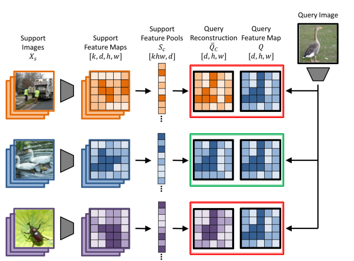
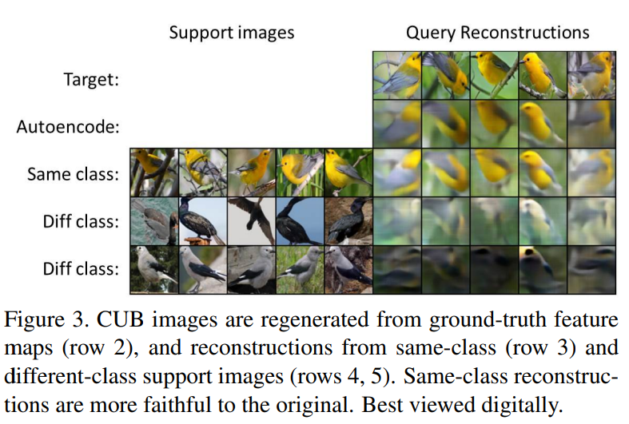

# Few-Shot Classification with Feature Map Reconstruction Networks

#### Link
[https://arxiv.org/abs/2012.01506](https://arxiv.org/abs/2012.01506)

## Abstract

- few-shot classification을 latent space 상에서의 reconstruction problem으로 생각
- support feature로부터 query feature를 closed form으로 regression
- Featuremap Reconstruction Network (FRN) : performance, computationally efficient

## Method

### Feature Map Ridge Regression

#### Notation

$X_s$ : support images

$x_q, y_q$ : query data, label

$Q \in \mathbb R^{r\times d} ~~(\mathbb R^{w\times h\times d})$ : feature map의 w, h, c (r=resolution)

$S_c = \mathbb R^{kr\times d}$ : support features in class c, (k support images)

#### Objective 

: find $W \in \mathbb R^{r \times kr}$ such that $WS_c \approx Q$

→ support feature map의 row weightes sum이 Q와 근사되는 W 찾기

- finding optimal W → solving the **linear least-squares problem**
    
    $\bar W = \argmin_W ||Q-WS_c||^2+\lambda ||W||^2$
    
    - $||\cdot ||$ : Frobenius norm = Euclidean norm = L2 norm
    - $\lambda$  : ridge regression constrpenalty term, constraint의 정도 조절
- widely-known closed-form solution for ridge regression formulation
    
    $\bar W = QS_c^T(S_cS^T_c+\lambda I)^{-1}$
    
- optimal reconstruction $\bar Q_c$
    
    $\bar Q_c = \bar W S_c$
    
- 주어진 class $c$에 대하여, feature map 상에서의 거리로 확률 계산 가능
    
    $\langle Q, \bar Q_c \rangle = \frac{1}{r} ||Q-\bar Q_c||^2$
    
    $P(y_q=c|x_q) = \frac{e^{(-\gamma \langle Q,\bar Q_c \rangle)}}{\sum_{c'\in C}e^{(-\gamma \langle Q,\bar Q_{c'} \rangle)}}$
    
    ($\gamma$ : temperature factor, **learnable parameter**)
    
    
    
- 기존 meta-training에서 사용하던 것처럼, 해당 확률과 정답의 CE Loss를 통해 network를 optimize

### Learning the Degree of Regularization

: how to set $\lambda$

$\bar W = \argmin_W ||Q-WS_c||^2+\lambda ||W||^2$ 

- $kr>d$ : support feature들이 feature space를 span할 수 있음
- $d>kr$ : reconstruction이 어려움

→ balance 있게 stable training을 진행하려면, $\lambda=\frac{kr}{d}$로 rescale하는 것이 좋음

- rescaling하더라도 클래스 간의 discriminativeness를 보장하는 $\lambda$를 찾지 못할 수 있음
    
    → 새로운 값 추가, 미리 지정하지 말고 **learn** 하자!
    
    $\bar Q_c = \rho \bar W S_c$
    
    $\lambda = \frac{kr}{d}e^\alpha, ~ \rho=e^\beta$ (모든 값이 0보다 크도록, 학습 가능)
    
    $\therefore learnable ~~parameter~: ~\alpha, \beta, \gamma$
    

### Parallelization

- 위의 식은 single query data x에 대한 것
- 각 data들의 optimal $r$  feature map → independent
- batch로 끊어서 그 만큼씩 동시에 진행 가능 ($Q'\in \mathbb R^{br\times d}$)

### Auxiliary Loss

$\mathcal L_{aux} = \sum_{i\in C}\sum_{j\in C, i\neq j}||\hat S_i\hat S_j^T ||^2$

- 서로 다른 클래스에 대한 support feature들이 feature space를 span하도록 유도

- 이 논문의 결과를 가장 잘 표현하는 그림
- 학습 class들에서 feature를 뽑은 후, query data에서 뽑은 feature space와 가장 비슷하게 reconstruction을 진행
- reconstruction 중 query와의 차이가 가장 적은 class로 예측

## Thoughts

- 정리 : support data로부터 얻은 feature를 각 class의 표현이라고 생각하는 metric learning의 일종, 적은 데이터를 가지고도 꽤 높은 정확도를 달성할 수 있다는 장점이 있음
