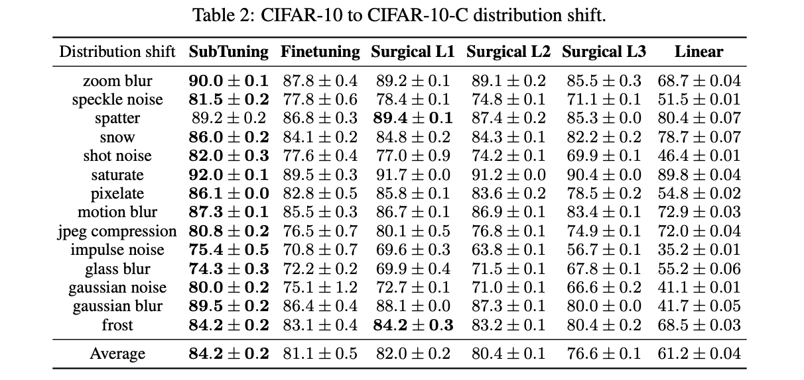

# Less is More: Selective Layer Finetuning with SubTuning

#### Link

[https://arxiv.org/abs/2302.06354](https://arxiv.org/abs/2302.06354)

#### Information

- Author/Institution : [Gal Kaplun](https://arxiv.org/search/cs?searchtype=author&query=Kaplun,+G), [Andrey Gurevich](https://arxiv.org/search/cs?searchtype=author&query=Gurevich,+A), [Tal Swisa](https://arxiv.org/search/cs?searchtype=author&query=Swisa,+T), [Mazor David](https://arxiv.org/search/cs?searchtype=author&query=David,+M), [Shai Shalev-Shwartz](https://arxiv.org/search/cs?searchtype=author&query=Shalev-Shwartz,+S), [Eran Malach](https://arxiv.org/search/cs?searchtype=author&query=Malach,+E)
- Conference/Journal : arXiv
- Cited by 2 _(2023.11.14)_
- Submitted on 13 Feb 2023, last revised 2 Jul 2023

## Abstract

- fine-tuning : novel task에 빠르게 수렴하고 성능을 향상시킬 수 있는 standard approach
- In this work, subset of layers를 선택적으로 학습하는 parameter-efficient fine-tuning method를 제안
- 다른 layer들은 전반적인 performance에 다르게 영향을 미친다는 것을 분석
- optimal layer subset은 task와 data distribution에 따라 달라진다는 것을 발견
- 본 논문에서 제안한 방법은 SubTuning (subset finetuning)으로, 기존 fine-tuning보다 몇몇의 장점이 있음
    - scare하거나 corrupted data 상황에서는 finetuning과 linear probing보다 더 좋은 성능을 냈음
    - small dataset에 대한 finetuning 방법과 비교했을 때 sota 달성
    - data가 부족한 상황에서 multi-task setting에서도 효과적인 결과를 냄
- 다양한 task, network architecture, pre-training method 상황에서 효과적임을 보였음

## Introduction

- linear probing : 모델의 head(linear layer)만 재학습 시켜서 사용
    - fit할 수 있는 부분의 용량이 작아 sub-optimal
- fine-tuning : 모델의 전체를 재학습 시켜서 사용
    - 보통 linear probing보다 나은 성능을 보이지만, training data와 computing 측면에서 비용 소모
- 본 연구에서는 linear probing과 fine-tuning 사이의 optimal point를 찾는 SubTuning 방식을 제안 (layer들의 subset)
    
    
    
    - Right : 이미지 개수가 적을수록 SubTuning이 효과적임을 입증하는 실험

## Related Work

- Parameter-Efficient Transfer-Learning
    - 거대 모델의 전부를 재학습 시키지 않고, few small layer나 mask를 network에 추가하여 적은 수의 parameter를 학습
    - parameter의 전부가 아닌 일부만 학습할 경우, catastrophic forgetting 을 방지할 수 있고, multi-task learning과 continual learning에 효과적
    - Prompt Tuning, adapters, LoRA, sidetuning, feature selection
- Lee et al. [33], selective layer finetuning이 적은 데이터셋에 대한 영향을 분석, 기존 fine-tuning보다 효과적임을 주장
    - 각 layer들이 결과에 미치는 영향이 다양
    - label shift : 뒤쪽의 layer, image corruption : 앞쪽의 layer
- Multi-Task Learning
    - 비슷한 성질을 가지고 있는 여러 task들을 한 번에 처리하는 것
    - common feature를 sharing하고 있다는 성질을 이용하여 solve
    - negative transfer, loss balancing, optimization difficulty, data balancing and shuffling
- Continual Learning
    - 이전에 학습한 정보는 어느 정도 유지하면서 새로운 task에 대한 학습도 진행하는 방법

## Key point

### Not All Layers are Created Equal

- 모델 성능에 대한 layer 각각의 기여가 동등하지 않다는 점은 finetuning에서 아주 중요하지만 과소평가되고 있는 부분
- 적절한 layer (혹은 layer set)를 고른다면 performance는 향상시키면서 computational resource는 절약 가능
- 본 연구에서는 두 가지 방법으로 이를 분석
    1. constructing the *finetuning profile*
        - optimal layer(혹은 block of layers)를 scanning : $O(n_{layer})$
    2. Greedy SubTuning algorithm
        - iterative하게 finetuning profile을 이용 → k-layers를 선택
        - $O(n_{layer}\cdot k)$

#### The Finetuning Profile

- network에서 각 layer가 미치는 영향과 중요성을 분석 → select 가이드
- 선택된 layer(subset)만 finetung을 진행, 나머지는 pretrained weight 유지

- 실험 환경
    - pretrained with ImageNet dataset
    - finetune with CIFAR-10 dataset, Flowers102 datasets
    - B : residual block
    - head 부분은 class 개수를 바꿔줘야 하기 때문에 항상 학습 진행
- 실험 결과
    - 모델 구조가 같더라도 학습 환경이 다르면 다른 finetuning profile을 갖기도 함
        
        → layer (subset)의 depth, number of parameter 등을 고려하지 않았기 때문 (ViT는 모든 layer가 동일한 parameter를, ResNet은 깊은 block일수록 더 많은 parameter를 가짐)
        
    - input과 가까운 모델의 앞 부분은 거의 성능에 영향을 미치지 않음을 확인
    - B13 > B15 : 더 깊고 많은 parameter를 가짐
        
        
        
    - 연이은 2개, 3개의 block을 선택하여 finetune한 경우, 좀 더 일정하게 성능이 증가함을 확인할 수 있음 (monotonic)
        
        
        

#### Greedy Selection

- consecutive한 layer들을 고르는 것은 supoptimal일 수 있기 때문에, 실험적으로 조합 가능한 모든 layer 쌍을 실험해본 결과 → B2와 B14의 쌍이 optimal

- 가능한 k개의 layer set을 모두 searching : $O(n_{layer}^k)$
- Greedy algorithm 사용 : $O(n_{layer}\cdot k)$
    - validation accuracy 증가에 가장 큰 기여를 한 layer를 선택
    - optimal solution의 approximation (특정 가정 아래에서)

- $\varepsilon$ : predetermined threshold, marginal benefit fall 고려

#### Theoretical Motivation

- 데이터가 적은 상황에서 Greedy SubTuning이 효과적임을 이론적으로 증명

$\theta\in \mathbb R^r$ : initial set of pretrained parameters

$\tilde \theta$ : new set of parameters (finetune을 진행한)

→ satisfying $||\theta-\tilde \theta||_2 \le \Delta$ (not full finetune, SubTuning)

$\Delta$가 충분히 작다면, first-order taylor expansion

$f_{\tilde\theta}(x)\approx f_\theta(x)+\left\langle \nabla f_\theta(x), \tilde \theta-\theta \right\rangle=\left\langle \psi_\theta(x), w\right\rangle$

- $\psi_\theta$ : Neural Tangent Kernel
- $w=\tilde \theta-\theta$ (norm $\le \Delta$인 벡터)

standard norm-based generalization bounds를 사용해 $w$를 optimize 하면,

generalization : $O(\frac{\sqrt r \Delta}{\sqrt{m}})$

- $r$ : number of parameters in the network
- $m$ : size of dataset
    
    → $r$이 클수록 좋은 성능을 위해서는 더 많은 data가 필요하다는 의미
    

- SubTuning은 일부만 training data에 재학습시키고, 나머지는 이전 task로부터의 weight를 사용하므로 overfitted될 가능성이 적음

##### Theorem 1.

Assume we run Greedy SubTuning over a network with $L$ layers, tuning at most $k$ layers with $r' \ll r$ parameters. Then the generalization error of the resulting classifier is $O(\frac{\sqrt{r'}\Delta\log(kL)}{\sqrt{m}})$

(Appendix에서 자세히 증명)

## Experiments

### SubTuning for Low Data Regime

- 비교군 : linear probing, finetuning, Head2Toe, LoRA
    - Head2Toe : network의 activation map으로부터 고른 상위 feature를 이용하여 linear layer 학습
    - LoRA : layer의 low rank decomposition을 이용하여 Transformer 내부의 residual branch를 학습
- VTAB-1k
    - Image Classification Benchmark, 19개의 vision task를 담고 있음
    - 5-fold cross-validation으로 정확도 측정
    - 데이터가 적은 상황(1k)에서는 Greedy SubTuning이 효과적
    
    
    
- Effect of Dataset Size
    
    
    
    
    

### Distribution Shift and Data Corruption

- Distribution Shift
    - source domain → target domain
        - domain : dataset
    - in this section, CIFAR-10 → CIFAR-10-C
        - CIFAR-10-C : corrupted CIFAR-10, 실생활 데이터 노이즈
            
            → robustness를 측정할 때 사용
            
        
        
        
        - 다른 방법보다 noise에 덜 민감하게 성능 유지
- Greedy Layer 분석
    - 전반적으로 적은 개수의 layer만 adaptation해서 성능 향상
    - 맨 마지막 layer가 성능에 영향을 가장 크게 줌을 확인
    - input-level shift는 이미지와 가까운 부분에서의 finetune으로 주로 해결됨 (앞과 중간 부분의 finetune이 많이 일어남)

### Efficient Multi-Task Learning with SubTuning

- 기존 task의 parameter는 고정, 새로운 task에 대한 parameter만 update

## Insight

- Greedy로 찾는 방법이기는 하지만, 시간이 오래 걸릴 것 같다고 생각함 (실험에 시간에 대한 언급 X)
- selection 문제로 접근 → 현재 상태에서 추가로 어떤 layer를 선택해야 좋은가를 판단할 수 있는 기준을 만들기